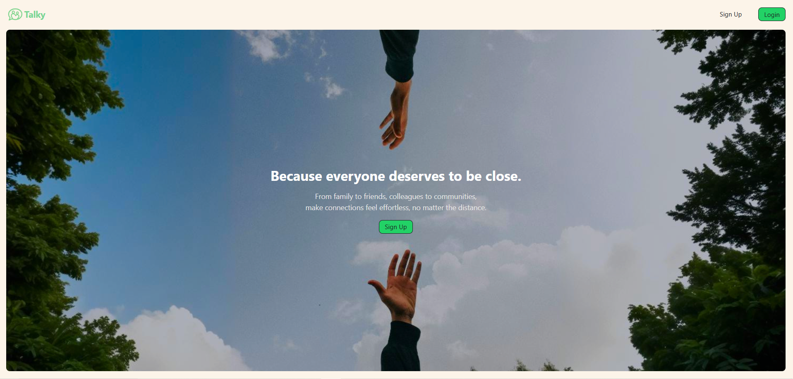
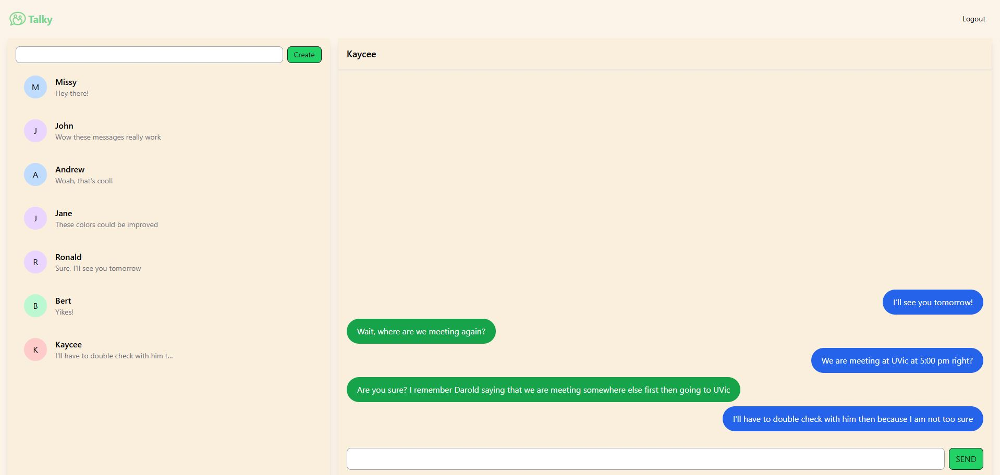

## Talky - Real Time Messaging Application

### Overview

Talky is a messaging application that uses web sockets to allow users to have real time conversations with other people. Users are able to create an account and chat with other users in a 1 to 1 settings. The frontend was designed with TypeScript and Vue, while the backend used Golang. User authentication uses JSON web tokens and data is stored within a PostgreSQL database.

#### Technology

<ul>
  <li> <strong>Languages</strong> : Golang, Typescript</li>
  <li> <strong>Frameworks</strong> : Vue, Node.js, Tailwind</li>
  <li> <strong>Database</strong> : PostgresSQL</li>
  <li><strong>Tooling</strong>: Docker</li>
</ul>

#### Installation

To be added

#### Screenshots

  

### Challenges
I took on this project as a way to learn a new language, Golang, for backend development. I also decided to pick up a new frontend framework, Vue 3. The main challenge was that I was trying to learn a new language entirely, as well as learn idiomatic ways of structuring my project. I spent more time making sure my backend followed idiomatic Go practices and focused on robust error handling. While it was a challenge at the start getting used to the syntax and common Go patterns, I quickly picked up the language and actually started to really like certain aspects of it—especially its error handling. Anytime I got stuck, I was able to refer to the docs and Google to quickly diagnose any problems, and overall, it was a good learning experience.

Another challenge outside of the backend was related to actually designing the application itself. Creating something from scratch is really hard, and creating visually pleasing and easy-to-use interfaces was something that really slowed me down. I picked up Figma to help me get a better idea of how I wanted my design to look, but I personally believe I could have done a lot better. I think my taste still needs to grow, but the only way to do that is to just keep designing and working away! Looking at it again, I should probably choose a more readable color scheme.

### What I learned
The main technical goals were to learn Golang and Vue to a point where I could comfortably use each language/framework, which I’m satisfied with. I learned a lot from books I read about building web servers in Golang and common design mistakes, which also extend to other languages. For example, I learned how helpful building out custom error functions and types was for debugging, and how a middleware that logs user requests was a lifesaver for seeing if things worked properly. I especially liked how Golang forced me to think a lot harder about how to properly handle errors, as it essentially requires you to check for errors before using any associated data. I look forward to continuing to make projects with these new ideas in mind.

